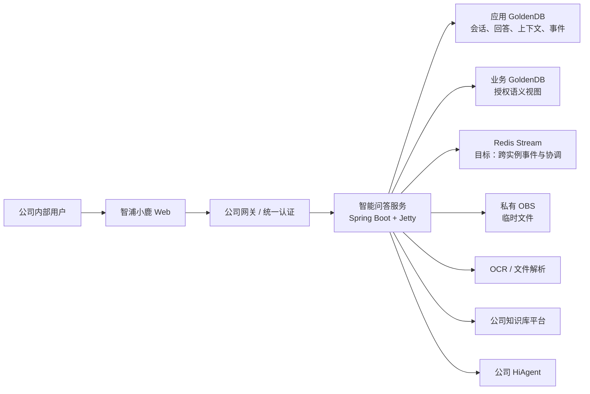
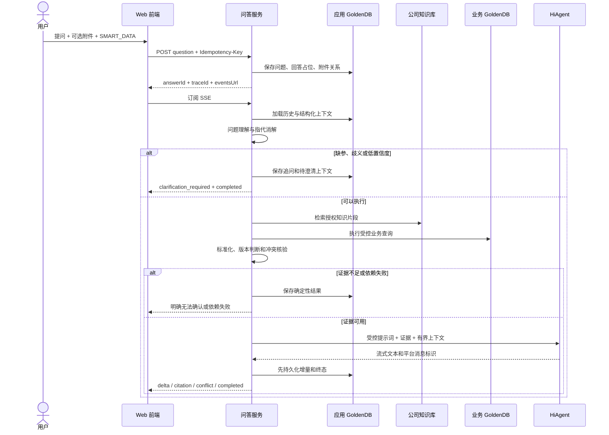
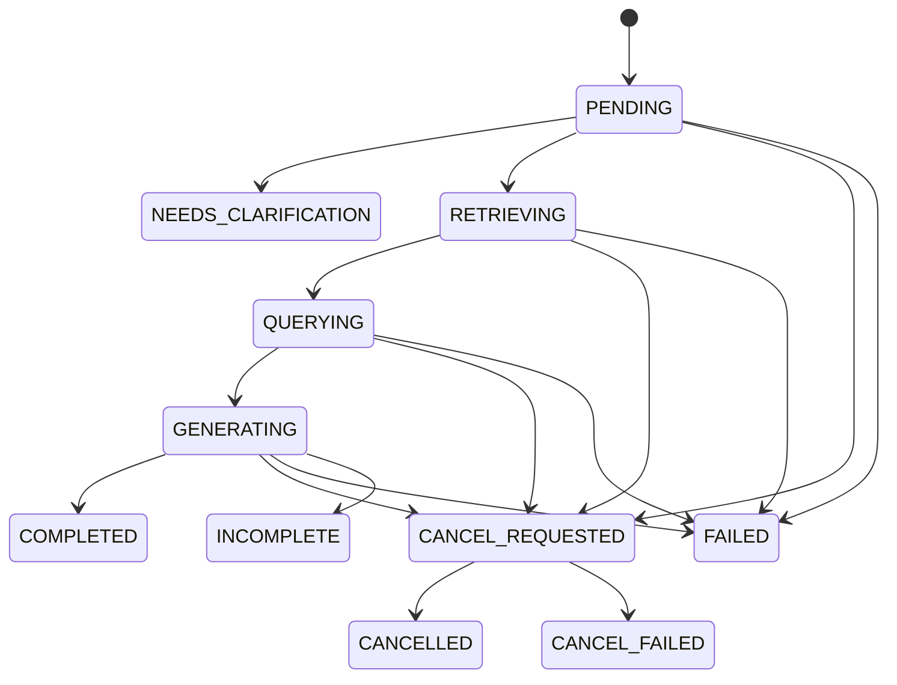
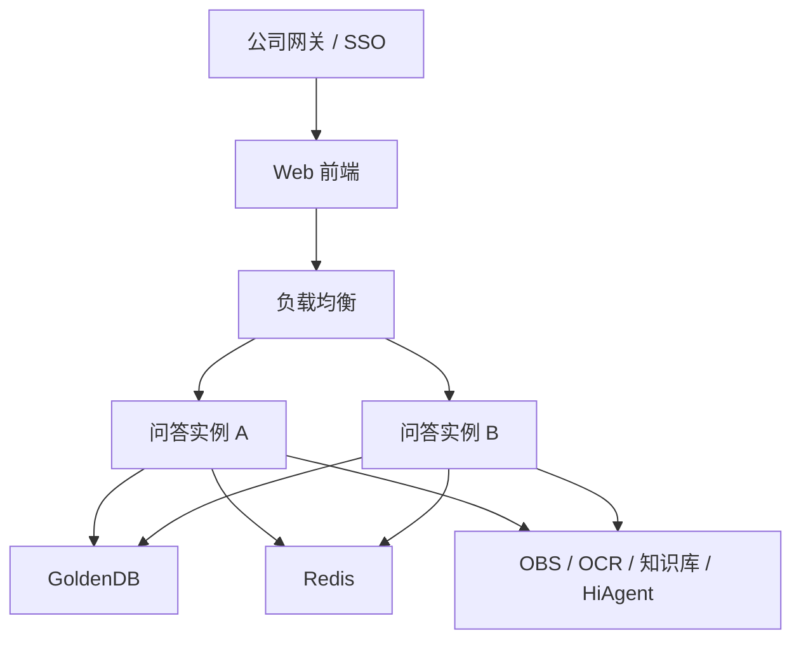

# AI 赋能项目一期技术方案设计说明书 V2.1

| 文档属性 | 内容 |
|---|---|
| 技术代号 | `intelligent-qa-audit-service` / `intelligent-qa-web` |
| 产品名称 | 智浦小鹿工作台 |
| 正式服务名称 | 待确认 |
| 文档版本 | V2.1 |
| 文档日期 | 2026-09-03 |
| 文档状态 | 一期技术评审稿 |
| 适用范围 | 智能问数、统一工作台和一期生产基础能力 |

> 本文以产品需求文档、后续确认结论、当前前后端工程和已接受 ADR 为依据。文中严格区分“目标方案”“当前已实现”和“生产待办”。未确认的公司接口、权限口径、生产地址、密钥和业务阈值均标记为 TBD，不得由代码或大模型自行假设。

## 1. 执行摘要

一期面向公司内部用户交付“智浦小鹿工作台”的智能问数能力。用户以自然语言或临时附件提出问题，系统完成问题理解，在权限范围内分别查询公司知识库和 GoldenDB 业务数据，对两个通道的结果进行确定性核验，再把经过筛选的证据交给公司 HiAgent 组织答案。

一期采用前后端分离、后端单体、内部六边形架构。问答流程使用“版本化场景计划 + 类型化上下文 + 可复用节点 + 轻量执行器”，不是把场景判断散落到每个节点，也不引入开放式 Agent 框架。当前只开放：

```text
前端 Agent：SMART_DATA（智能问数）
后端场景：DUAL_CHANNEL_QA（双通道问答）
场景版本：1
```

纯 LLM、制度库查询、合同智能审核、合同差异比对和申赎确认单处理均不在一期执行范围内。

## 2. 已确认决策与约束

| 主题 | 一期结论 |
|---|---|
| 用户 | 公司内部用户 |
| 容量 | 持续 10 QPS 问答提交量，至少 50 个并发用户 |
| 统一认证 | 正式环境必须接入公司统一认证；开发环境允许配置化模拟用户 |
| Agent 目录 | 前端本地配置；后端不提供 `/api/v1/agents` |
| 开放能力 | 仅“智能问数”，请求类型为 `SMART_DATA` |
| 查询模式 | 公司知识库 + GoldenDB 双通道查询 |
| 企业知识管理 | 由公司知识库平台负责，本系统只调用检索接口 |
| 业务数据 | 数据中台同步到 GoldenDB，本系统查询批准的只读语义视图 |
| SQL 安全 | 禁止模型生成并直接执行任意 SQL |
| 临时文件 | 一期支持，既可作为查询输入，也可作为回答证据 |
| OCR | 一期支持扫描 PDF 和图片 OCR |
| OBS | 私有 OBS；允许 HiAgent 读取单对象短期只读 URL |
| 大模型 | 按公司 HiAgent 运行态 API 调用 |
| 冲突处理 | 展示全部来源值和时间，提示人工复核，不由模型裁决 |
| 后端运行时 | Java 8、Spring Boot 2.7.18、内嵌 Jetty、Maven |
| 数据访问 | MyBatis-Plus + MyBatis XML |
| 环境配置 | 开发、测试、生产分别使用 XML 配置 |
| 注释规范 | Java 和 TypeScript 的类型、字段、方法及入参使用准确中文注释 |

## 3. 建设范围

### 3.1 一期包含

1. 统一工作台、Agent 选择、会话搜索、分组、游标分页和虚拟滚动。
2. 新建、选择、改名和删除会话；活动会话禁止删除。
3. 问题提交、SSE 流式回答、执行阶段、结果、来源与产物展示。
4. 产品及交易基础信息问答：产品经理、投资经理、产品形式、状态、日期、费率、分层、费率调整计划和单笔交易员等。
5. 产品最新信息问答：最新说明书、费率调整公告、备案通知书及关键要素。
6. 意图识别、实体提取、指代消解、歧义处理、缺参追问和上下文恢复。
7. 公司知识库与 GoldenDB 双通道查询、证据标准化、冲突识别和人工复核提示。
8. PDF、DOCX、XLSX、TXT、MD、JPG、JPEG、PNG 临时附件，单文件不超过 1 MiB。
9. 扫描 PDF/图片 OCR、Excel 查询参数提取和文件证据处理的目标链路。
10. 停止生成、部分答案保留、反馈、重新生成和刷新恢复。

### 3.2 一期不包含

- 建设知识库上传、维护、解析、切片、向量化或索引平台。
- 纯 LLM、指定制度库等其他场景的开放执行。
- 合同智能审核、合同差异比对和申赎确认单处理的业务实现。
- 任意自然语言取数、自由 Schema 探索、动态跨表 Join 和任意 SQL 执行。
- 开放式 ReAct 循环、多 Agent 自主协作或无人监管的高风险业务决策。
- 自建登录页、完整用户管理后台和正式知识管理后台。

## 4. 质量目标

| 质量属性 | 目标 |
|---|---|
| 准确性 | 无证据不回答事实；冲突不裁决；低置信度先追问 |
| 可用性 | 单实例故障不丢失已持久化答案；生产至少双实例 |
| 可恢复性 | 页面刷新恢复答案、阶段、引用和状态；任务目标支持进程重启恢复 |
| 安全性 | Owner 隔离、最小权限、固定 SQL、私有 OBS、敏感日志最小化 |
| 可扩展性 | 新场景通过注册计划组合节点，不修改已有节点中的场景分支 |
| 可观测性 | 全链路 `traceId`，阶段时延、依赖成功率、准确性和任务指标可监控 |
| 性能 | 10 QPS 提交、50 并发用户；连接池、长连接和外部配额联合压测 |
| 可维护性 | 六边形依赖、中文注释、静态分析、架构测试和覆盖率门禁 |

准确率、召回率、首字时延、完整回答时延和可用性数值阈值仍需业务、风险、数据和运维共同签署，本文不虚构指标。

## 5. 方案选择

### 5.1 单体与微服务

选择：一期保持一个问答后端单体，在代码内部形成可拆分端口。

未选择：一期立即拆分 RAG/模型访问微服务。原因是统一认证、权限传递、任务一致性、事件重放、故障排查和部署成本会在外部契约尚未冻结时显著增加。

后续拆分条件：至少两个项目稳定复用；输入输出、权限、审计、SLA 和计费边界稳定；具备独立运维与容量责任人。

### 5.2 工作流编排

选择：场景计划注册表集中决定节点组合与顺序，通用执行器统一处理跳过、短路、停止检查和节点记录。

未选择：每个责任链节点自行判断全部场景类型。该方式会导致场景矩阵散落、重复分支增多，新增场景时必须修改所有旧节点。

未选择：一期引入第三方 Agent/Graph 框架。当前流程固定、风险可控，框架收益不足以抵消 Java 版本、状态模型和运维复杂度。

## 6. 总体架构



### 6.1 信任边界

- 浏览器输入、模型输出、知识片段、文件内容和 OCR 文本均是不可信数据。
- 身份、功能权限、知识权限和数据权限只由服务端认证上下文决定。
- GoldenDB 应用库是会话、答案、任务和审计的最终事实源。
- Redis 只负责事件分发和协调，不作为答案最终事实源。
- HiAgent 只负责受控理解或语言生成，不是业务事实源。

## 7. 前端架构与交互

前端采用 React + TypeScript + Vite，并使用轻量六边形分层：

```text
presentation  页面组件和样式
      ↓
application   控制器、状态机和端口
      ↓
domain        页面所需的最小领域类型
      ↑
infrastructure  HTTP、SSE 和 XML 运行配置适配器
```

### 7.1 统一工作台

- 品牌为“智浦小鹿”，页面名称为“智浦小鹿工作台”。
- Agent 只在输入区选择，默认且仅开放“智能问数”。
- 附件按钮位于输入区工具栏最左侧，不显示冗余文字。
- 未开放 Agent 不创建会话、不提交问题，只提示“该功能尚未开放”。
- 助手回答分为执行过程、执行结果、来源与产物三个区域。
- 模型文本使用受控 Markdown 解析，不执行原始 HTML。

### 7.2 会话列表

- 后端提供不透明稳定游标，前端按页去重并虚拟化渲染。
- 按浏览器本地自然日分为“今天、昨天、更早”。
- 默认标题取首次有效提问去除首尾空白后的前 100 个字符。
- 如果附件先创建了“新聊天”占位，首次提问时更新为上述默认标题。
- 人工修改后的名称不被后续问题覆盖。
- 会话图标和操作图标固定尺寸，不随标题长度压缩。
- 长标题默认单行省略；悬停 0.7 秒后，以约 30 像素/秒匀速向左滚动；开启减少动画时即时展示。
- 顶部当前会话标题静态省略，并为右侧操作按钮保留固定空间。

### 7.3 前端恢复原则

- 提交成功后的用户消息和附件立即展示，但以服务端持久化结果为最终事实。
- 刷新后从历史消息恢复附件、执行事件、引用、人工复核提示和回答状态。
- SSE 中断但未收到终态时先读取回答快照，再决定重连。
- 发生事件重放缺口时丢弃不可信的本地拼接，回退 GoldenDB 快照。
- 页面渲染异常由错误边界显示恢复入口，不允许直接白屏。

### 7.4 对话管理详细设计

#### 7.4.1 公共约定

- 会话归属用户只能取自后端可信认证上下文，前端不得传递或覆盖 `ownerId`。
- 会话列表按 `updatedAt DESC, id DESC` 稳定排序，只返回当前用户未删除的会话。
- `cursor` 是服务端生成的不透明游标，前端只能原样回传；搜索条件变化时必须丢弃旧游标并从首页重新查询。
- `createdAt`、`updatedAt` 和消息时间统一返回 UTC ISO-8601，前端按浏览器本地自然日展示“今天、昨天、更早”。
- 前端虚拟滚动只控制 DOM 节点数量；数据是否还有下一页只能依据服务端 `hasMore` 判断。
- 所有写操作成功后以前端局部更新为主，并在必要时重新拉取；失败时保留用户输入，不伪造成功状态。

| 功能 | 前端主要动作 | 后端接口 | 当前状态 |
|---|---|---|---|
| 创建对话 | 进入本地草稿，首次提问或首次上传附件时落库 | `POST /api/v1/chats` | 已实现 |
| 搜索对话 | 输入防抖、重置游标、按页展示 | `GET /api/v1/chats?keyword=&cursor=&limit=` | 分页已实现；后端关键词过滤待补 |
| 重命名对话 | 弹窗校验，成功后更新列表与顶部标题 | `PATCH /api/v1/chats/{chatId}` | 已实现 |
| 删除对话 | 二次确认，活动回答时禁止删除 | `DELETE /api/v1/chats/{chatId}` | 已实现 |
| 打开历史会话 | 加载会话、消息、附件、执行事件与回答快照 | `GET /api/v1/chats/{chatId}`、`GET /api/v1/chats/{chatId}/messages`、`GET /api/v1/answers/{answerId}` | 已实现有界恢复 |

#### 7.4.2 后端 API 汇总

| 方法名 | URL | method | 入参 | 出参 |
|---|---|---|---|---|
| `createConversation` 创建会话 | `/api/v1/chats` | `POST` | Body：`title`，必填，去除首尾空白后 1～100 字符；用户身份从认证上下文获取 | `201 Created`；Header：`Location`；Body：`Conversation {id, title, createdAt, updatedAt}` |
| `listConversations` 分页查询/搜索会话 | `/api/v1/chats` | `GET` | Query：`keyword` 可选、最长 100 字符，仅搜索标题；`cursor` 可选、不透明游标；`limit` 可选、默认 50、范围 1～100。当前代码尚未实现 `keyword` | `200 OK`；`ConversationPage {items, nextCursor, hasMore}` |
| `getConversation` 查询会话详情 | `/api/v1/chats/{chatId}` | `GET` | Path：`chatId`，当前用户可访问的会话 UUID | `200 OK`；`Conversation {id, title, createdAt, updatedAt}` |
| `listConversationMessages` 查询历史消息 | `/api/v1/chats/{chatId}/messages` | `GET` | Path：`chatId`；Query：`limit` 可选、默认 100、范围 1～100 | `200 OK`；按时间正序的 `Message[]`，包含附件、回答状态、执行事件和引用产物 |
| `getAnswerSnapshot` 查询回答快照 | `/api/v1/answers/{answerId}` | `GET` | Path：`answerId`，当前用户可访问的回答 UUID | `200 OK`；`Answer {answerId, questionId, traceId, status, content, errorCode, cancelReason, cancelledStage, cancelErrorCode, streamPath, createdAt, completedAt, cancelRequestedAt, cancelledAt}` |
| `subscribeAnswerEvents` 恢复回答事件流 | `/api/v1/answers/{answerId}/events` | `GET` | Path：`answerId`；Header：`Accept: text/event-stream`；`Last-Event-ID` 可选 | `200 OK`；SSE 事件流，每条包含 `id`、`event`、`data.value` 和 `data.occurredAt`；重放缺口返回 `409` |
| `renameConversation` 重命名会话 | `/api/v1/chats/{chatId}` | `PATCH` | Path：`chatId`；Body：`title`，必填，去除首尾空白后 1～100 字符 | `200 OK`；更新后的 `Conversation {id, title, createdAt, updatedAt}` |
| `deleteConversation` 删除会话 | `/api/v1/chats/{chatId}` | `DELETE` | Path：`chatId`；无 Body | `204 No Content`；执行中返回 `409`，提示“会话正在执行，请停止后删除” |

所有接口都要求有效认证身份；开发环境可通过显式开关启用模拟用户。`404` 统一表示当前用户下资源不存在、已删除或不可访问，不得据此探测其他用户数据。

#### 7.4.3 创建对话

1. 用户点击“新建会话”时，前端只清空当前选择并进入本地草稿状态，不立即调用后端。
2. 用户首次发送问题时，前端将问题去除首尾空白并截取前 100 个字符作为默认标题，调用 `POST /api/v1/chats`。
3. 创建成功后，前端使用返回的 `chatId` 调用 `POST /api/v1/chats/{chatId}/questions`，问题与回答任务由后端持久化。
4. 如果用户先上传附件，由于附件必须归属于确定会话，前端先以“新聊天”调用创建接口，再上传附件；首次提问时通过重命名接口替换为问题标题。这是“首次提问落库”的附件场景例外。
5. 创建成功但问题提交失败时保留已创建会话、附件和用户输入，允许用户重试；不得再次静默创建重复会话。

当前创建接口未接收 `Idempotency-Key`。一期生产冻结前应在前端提交期间禁用重复点击，并评估为创建接口增加幂等键，防止网络重试产生重复空会话。

#### 7.4.4 搜索对话

1. 前端对搜索输入进行 300～500 毫秒防抖；输入变化时清空结果和旧游标。
2. 后端仅在当前用户未删除的会话标题中进行包含匹配，不搜索消息正文、附件正文或模型回答，避免越权、性能放大和敏感信息扩散。
3. `keyword` 去除首尾空白后最长 100 个字符；空值等价于普通会话分页。
4. 后端必须对 `%`、`_` 和转义字符进行安全处理并使用 MyBatis 参数绑定，禁止拼接 SQL。
5. 返回结果继续采用稳定游标分页；同一个游标只能与生成它时相同的用户和关键词共同使用，条件不一致返回 `400 Invalid request`。
6. 前端接近虚拟列表底部时加载下一页并按 `id` 去重；`hasMore=false` 后停止请求。

当前前端只对已经加载到浏览器的会话做本地过滤，无法检索尚未加载的后续页面。服务端 `keyword` 过滤属于一期待补能力，完成后前端本地过滤只能作为即时展示优化，不能作为最终搜索结果。

#### 7.4.5 重命名对话

1. 用户打开重命名弹窗时回显当前标题；点击遮罩、取消按钮或按 `Esc` 关闭弹窗且不提交。
2. 前端校验去除首尾空白后为 1～100 个字符，再调用 `PATCH /api/v1/chats/{chatId}`。
3. 后端再次校验标题，并以 `ownerId + chatId + deletedAt IS NULL` 作为更新条件，避免修改其他用户或已删除会话。
4. 成功后，前端同步更新左侧列表与顶部静态标题；失败时保留用户输入并展示安全错误信息。
5. 当前采用最后写入者生效，不提供版本号或 `If-Match`；若后续出现多端同时编辑需求，再增加乐观锁版本。

#### 7.4.6 删除对话

1. 前端先展示不可恢复的二次确认，不在确认前调用后端。
2. 后端在事务内按 `ownerId + chatId` 锁定活动会话，再检查是否存在 `PENDING`、`RETRIEVING`、`QUERYING`、`GENERATING` 或 `CANCEL_REQUESTED` 回答。
3. 存在活动回答时返回 `409 Conflict`，目标稳定错误码为 `CONVERSATION_ACTIVE`，提示固定为“会话正在执行，请停止后删除”；前端不得自动替用户停止回答。
4. 不存在活动回答时设置 `deletedAt` 和 `updatedAt` 完成逻辑删除，返回 `204 No Content`。
5. 删除当前打开的会话后，前端清空消息、附件和流连接并进入新对话草稿；删除非当前会话时只从列表移除对应项。
6. 已删除、其他用户所有或不存在的会话统一返回 `404`，不得暴露资源是否真实存在。

#### 7.4.7 打开及恢复历史会话

1. 用户选择历史会话后，前端先调用 `GET /api/v1/chats/{chatId}` 验证会话存在并取得最新标题，再调用 `GET /api/v1/chats/{chatId}/messages?limit=100`。
2. 历史消息按时间正序展示；用户消息恢复附件元数据，助手消息恢复 `answerId`、`answerStatus`、`executionEvents` 和 `artifacts`。
3. 对终态回答直接使用 GoldenDB 中的消息、执行事件和引用产物恢复页面，不重新执行问答。
4. 对活动回答先调用 `GET /api/v1/answers/{answerId}` 取得持久化快照，再从已知最大事件序号使用 `Last-Event-ID` 连接 SSE，继续接收增量事件。
5. SSE 返回 `409 EVENT_REPLAY_GAP`、断线超过重试窗口或页面状态不确定时，丢弃本地未确认拼接，重新读取回答快照；终态则停止重连，非终态再恢复订阅。
6. 当前消息接口最多返回最近 100 条消息，能够满足一期有界恢复，但不支持超长会话向上翻页。若一期验收样本可能超过 100 条，应在契约冻结前增加消息不透明游标并同步修改前端。

### 7.5 问答管理后端 API 汇总

| 方法名 | URL | method | 入参 | 出参 |
|---|---|---|---|---|
| `submitQuestion` 提交问题 | `/api/v1/chats/{chatId}/questions` | `POST` | Path：`chatId`；Header：`Idempotency-Key` 必填；Body：`agentType` 必填，一期仅 `SMART_DATA`；`question` 必填、1～4000 字符；`files` 可选、最多 5 个，每项包含 `fileId` 和 `usage`，`usage` 为 `AUTO`、`QUERY_INPUT` 或 `EVIDENCE` | `202 Accepted`；Header：`Location` 为回答事件流地址；Body：`Answer {answerId, questionId, traceId, regeneratedFromAnswerId, status, content, errorCode, cancelReason, cancelledStage, cancelErrorCode, streamPath, createdAt, completedAt, cancelRequestedAt, cancelledAt}` |
| `getAnswerSnapshot` 查询回答快照 | `/api/v1/answers/{answerId}` | `GET` | Path：`answerId`，当前用户可访问的回答 UUID | `200 OK`；Body：完整 `Answer` 快照，`content` 为已经持久化的完整或部分回答 |
| `subscribeAnswerEvents` 订阅回答流 | `/api/v1/answers/{answerId}/events` | `GET` | Path：`answerId`；Header：`Accept: text/event-stream`；`Last-Event-ID` 可选，首次默认为 `0`，重连时传最后完整处理的事件序号 | `200 OK`；SSE 事件流，每条包含 `id`、`event`、`data.value`、`data.occurredAt`；事件包括阶段、增量文本、引用、人工复核、完成、取消和错误 |
| `cancelAnswer` 停止生成回答 | `/api/v1/answers/{answerId}/cancellation` | `POST` | Path：`answerId`；Header：`Idempotency-Key` 必填；Body：`reason` 必填，一期固定为 `USER_REQUESTED` | 正在停止时返回 `202 Accepted` 和 `Answer`；已经进入终态时返回 `200 OK` 和当前 `Answer`；不存在返回 `404`；终态冲突返回 `409` |
| `regenerateAnswer` 重新生成回答 | `/api/v1/answers/{answerId}/regenerations` | `POST` | Path：原 `answerId`；Header：`Idempotency-Key` 必填；无 Body。后端读取原问题、Agent 和附件快照，创建新的完整问答轮次 | `202 Accepted`；Header：`Location` 为新回答事件流地址；Body：新的 `Answer`，其中 `regeneratedFromAnswerId` 指向原回答 |
| `recordAnswerFeedback` 提交喜欢/不喜欢 | `/api/v1/answers/{answerId}/feedback` | `PUT` | Path：`answerId`；Body：`feedback` 必填，可取 `LIKE` 或 `DISLIKE` | `204 No Content`；重复提交按最后一次评价更新 |

复制回答不提供后端 API：前端直接将当前已展示并持久化的回答文本写入浏览器剪贴板，并根据成功或失败显示交互提示。

问答写接口均按当前认证用户隔离。提交、停止和重新生成必须使用独立幂等键；相同幂等键与相同请求返回原结果，相同键对应不同请求时返回 `409 IDEMPOTENCY_CONFLICT`。

## 8. 后端六边形架构

```text
domain
  ├─ model                 领域状态、证据、意图和场景
  └─ port
     ├─ in                 会话、问答、停止、反馈用例
     └─ out                仓储、知识库、业务库、模型、事件、OBS 端口
application
  ├─ service               用例、事务和生命周期编排
  └─ workflow              场景计划、上下文、执行器和节点
adapter.in.web             REST、SSE、参数校验、错误映射
adapter.out                MyBatis、HiAgent、事件和外部平台适配器
config                     XML 配置绑定和依赖装配
```

领域层不得依赖 Spring、MyBatis、Redis、OBS SDK、HTTP 客户端或序列化框架。外部供应商通过端口隔离，以便替换和契约测试。

## 9. 场景计划驱动的问答工作流

### 9.1 路由

```text
请求 agentType=SMART_DATA
        ↓
AgentType 白名单校验
        ↓
QueryScenario=DUAL_CHANNEL_QA
        ↓
ScenarioPlanRegistry 选择版本 1
```

未注册场景必须失败关闭，不能回退为默认模型调用。

### 9.2 一期节点顺序

```text
QUESTION_UNDERSTANDING
        ↓
KNOWLEDGE_RETRIEVAL
        ↓
BUSINESS_DATA_QUERY
        ↓
EVIDENCE_RECONCILIATION
        ↓
ANSWER_GENERATION
```

当前代码按顺序执行，不是并行双查。后续只有在超时预算、取消传播、错误合并、限流和证据快照规则明确后，才考虑并行知识库与数据库节点。

### 9.3 执行规则

- 节点不判断所有场景，只通过 `shouldExecute` 判断自身数据前置条件。
- 前置条件不满足时记录 `SKIPPED`，执行器自动进入下一节点。
- 追问等合法业务短路返回 `STOP`，后续节点不得执行。
- 每个节点之间检查停止请求。
- 上下文记录计划版本和 `STARTED/SUCCEEDED/SKIPPED/FAILED` 生命周期。
- 未预期异常原样上抛到任务顶层边界，不在节点执行器中吞掉。

## 10. 完整问答处理流程



## 11. 问题理解、上下文与追问

问题理解输出必须是结构化对象，而不是自然语言或 SQL：

```text
decision          RESOLVED | CLARIFICATION_REQUIRED | UNSUPPORTED
intent            标准业务意图
confidence        置信度
resolvedQuestion  完成指代消解后的规范化问题
entities          类型、标准值、来源消息 ID、置信度
requestedFields   用户需要的标准字段
missingFields     缺少的必填参数
candidates        经权限过滤的候选
clarification     原因、提示和可选择项
```

只有 `RESOLVED` 可以进入查询节点。以下情况必须追问：

- “它”“这个产品”等指代无法由可信上下文证明。
- 多个授权候选无法唯一确定。
- 产品代码、交易流水号等必填参数缺失。
- 意图置信度低于配置阈值。

追问是合法终态，不是系统失败。追问分支不调用知识库、业务数据库、对账或答案模型。待澄清状态按 Owner + Conversation 持久化，补充参数后原子消费；明确的新问题可以放弃旧追问。

## 12. 业务数据库查询方案

一期以业务语义层为核心、受控关系为支撑、查询计划为执行中枢：

```text
自然语言与已消歧实体
        ↓
业务语义解析
        ↓
标准实体 / 字段 / 条件识别
        ↓
一期语义目录校验
        ↓
Query Plan
        ↓
固定 SQL Statement 选择与参数校验
        ↓
MyBatis 参数绑定
        ↓
GoldenDB 产品主题快照表
```

### 12.1 一期语义范围

| 实体 | 标准字段 |
|---|---|
| 产品 | 产品代码、名称、简称、全称、产品经理、监管口径投资经理、产品部口径投资经理、定开基准日期、到期日期、快照日期 |
| 交易 | 交易流水号、所属产品代码、交易员、交易日期 |

一期产品 Query Plan 允许 `PRODUCT_LOOKUP` 与 `PRODUCT_REFERENCE_DATE_LIST`，并兼容既有 `TRADE_LOOKUP`。SQL Compiler 只能选择预先评审的参数化 MyBatis 语句。用户值全部使用 `#{}` 绑定，模型不能产生可直接执行的 SQL。

### 12.2 数据表目标

| 数据表或兼容视图 | 用途 | 强制条件 |
|---|---|---|
| `dws_product_info_d` | 产品每日全量快照 | 最新有效 `DT` + 产品实体或业务日期条件 + 有界结果 |
| `biz_semantic_trade_v` | 交易标准事实 | Owner/授权用户条件 + 交易流水号精确匹配 |

Flyway 创建产品空表和索引，数据中台负责同步业务快照。产品表的数据权限、完整快照发布、数据量和索引由数据平台与 DBA 签署。

## 13. 公司知识库方案

公司知识库平台负责上传、维护、解析、切片和索引。本系统只传入规范化问题、实体、知识权限和结果上限，并接收可追溯片段。

知识片段至少需要：稳定片段 ID、文档 ID、标题、版本、发布/生效时间、页码或章节、相关度、权限标签和检索时间。认证、分页、限流、超时、错误码和“最新文档”语义仍待平台确认。

## 14. 临时文件、OBS 与 OCR

### 14.1 文件角色

| 角色 | 含义 | 后续处理 |
|---|---|---|
| `QUERY_INPUT` | 产品编号、交易流水号等问题补充条件 | 解析、校验、去重、限量后进入查询参数；不作为证据 |
| `EVIDENCE` | 文件正文包含可能支撑答案的事实 | 解析/OCR 后进入证据、引用与冲突核验 |
| `AUTO` | 尚未确定用途 | 可靠识别；不确定时向用户确认 |

例如 Excel 包含一批产品编号时，Excel 是查询输入。系统按工作表和行号提取编号，校验、去重、限量并逐项查询；最终事实来源是知识库或 GoldenDB，不能把 Excel 文件本身显示为回答证据。

### 14.2 目标处理链路

```text
校验 Owner / 会话 / 扩展名 / MIME / 文件头 / 大小
        ↓
建立文件记录和上传幂等键
        ↓
上传私有 OBS
        ↓
安全扫描
        ↓
文本解析 / Excel 解析 / OCR
        ↓
用途确认与结果持久化
        ↓
READY | FAILED | QUARANTINED
```

文件只有 `READY` 才能随问题提交。OBS 对象键由服务端生成；短期签名 URL 不返回前端、不写入答案、不完整记录日志。数据库与 OBS 不使用分布式事务，通过状态机、幂等和补偿任务处理孤儿对象。

### 14.3 上传先于提问

目标要求空白草稿不产生可见历史会话，但现有上传 API 必须携带 `chatId`。目标方案采用隐藏的 `DRAFT` 会话：

1. 首次上传附件时创建 `DRAFT` 会话，不进入普通历史列表。
2. 首次有效提问在同一事务中把会话转为 `ACTIVE`，标题取首问前 100 个字符。
3. 用户人工改名后不再自动覆盖。
4. 长时间未提问的 DRAFT 会话和孤立附件由有界清理任务处理。

当前代码仍使用可见“新聊天”占位并在首问时改名，尚需数据模型和列表查询收口，因此不能宣称完全满足“首问才落库”。

## 15. 统一证据与冲突处理

证据项至少包含：

```text
sourceType          KNOWLEDGE_BASE | BUSINESS_DATABASE | TEMPORARY_FILE
sourceId            稳定来源标识
title               可展示标题
fieldName           标准业务字段
normalizedValue     归一化值
rawValue            受控原始值
effectiveTime       业务生效时间
version             文档或数据版本
authorizationLabel  权限标签
citationLocation    页码、章节、工作表或行号
retrievedAt         本次查询时间
```

确定性代码负责主键、日期、费率、金额、人员、枚举和版本标准化。对账结果至少包括：一致、冲突、证据不足、单来源、依赖失败和低置信度。

- 一致：保留全部可追溯来源。
- 冲突：先持久化并展示每个来源的值、时间和位置，再提示人工复核。
- 证据不足：明确说明无法确认，模型不得补事实。
- 依赖失败：展示依赖失败，不伪装为“未查询到”。

## 16. HiAgent 集成

按公司运行态接口执行：

```text
POST /create_conversation  -> AppConversationID
POST /chat_query           -> text/event-stream + MessageID
POST /stop_message         -> 停止指定 MessageID
```

每次回答创建独立平台会话。本系统长期上下文仍以 GoldenDB 为准。发送给 HiAgent 的 Query 只包含系统规则、已确认意图、有界上下文、经权限校验的证据、冲突标识和输出格式约束。

重新生成不调用平台“再次生成”捷径，而是创建新的问题和回答，复制原问题及固化附件用途，重新执行完整查询和核验。原问题与原回答永久保留。

真实认证头、必填 Inputs、文件对象结构、流事件、结束/错误事件和 MessageID 层级必须用脱敏样例完成契约测试后才能启用生产适配器。

## 17. API 详细契约

本节是一期 API 评审基线，覆盖浏览器调用后端、后端调用公司平台以及后端内部出站端口。接口按以下状态标记：

| 状态 | 含义 |
|---|---|
| 已实现 | 当前代码中已有接口与字段，联调以自动化测试和实际响应为准 |
| 目标 | 一期必须实现，但当前代码尚未完成 |
| 拟定 | 本系统给出的对接建议，必须由公司平台、数据、安全或云平台负责人签署后才能冻结 |

### 17.1 通用约定

| 项目 | 约定 |
|---|---|
| 后端基础路径 | `/api/v1` |
| 传输 | 生产必须使用 HTTPS；JSON 使用 UTF-8 |
| 时间 | ISO 8601 UTC，例如 `2026-09-03T08:30:00Z` |
| ID | 本系统资源使用 UUID 字符串；游标是不透明字符串，只能原样回传 |
| 认证 | 正式环境由公司统一认证建立可信身份；开发环境可通过开关启用模拟用户 |
| Owner 隔离 | `ownerId` 只从认证主体取得，前端请求体不得传入或覆盖 |
| Agent | 不提供 `/api/v1/agents`；前端本地维护列表，提交问题时传稳定枚举 `agentType` |
| 幂等 | 创建外部副作用的接口携带 `Idempotency-Key`，最长 128 字符；目标实现同时保存请求指纹 |
| 链路追踪 | 目标要求网关生成或透传 `X-Trace-Id`，后端响应同步返回；字段名需与公司网关确认 |
| 内容协商 | 普通接口为 `application/json`；错误为 `application/problem+json`；回答流为 `text/event-stream` |
| 空值 | 未产生的可选值返回 `null`；集合返回 `[]`，不返回 `null` |
| 字段演进 | 新增可选字段保持向后兼容；删除、改名或改变语义必须升级 API 大版本 |

所有前端调用都使用统一认证产生的安全 Cookie 或公司网关指定凭据。前端不得在 URL、日志或本地长期存储中保存令牌、OBS 对象键或签名 URL。

### 17.2 通用响应对象

#### 17.2.1 `Conversation` 会话

```json
{
  "id": "7b276a10-e7a7-44c3-902a-e73026f405a2",
  "title": "查询悦享一号产品信息",
  "createdAt": "2026-09-03T08:30:00Z",
  "updatedAt": "2026-09-03T08:31:00Z"
}
```

`title` 为 1～100 个字符。会话列表按 `updatedAt` 和稳定 ID 倒序，标题分组和鼠标悬停滚动由前端完成。

#### 17.2.2 `TemporaryFile` 临时文件

```json
{
  "id": "f491a01d-e75a-4d08-bdf3-452db66d8938",
  "conversationId": "7b276a10-e7a7-44c3-902a-e73026f405a2",
  "name": "产品编号.xlsx",
  "contentType": "application/vnd.openxmlformats-officedocument.spreadsheetml.sheet",
  "sizeBytes": 2048,
  "usage": "QUERY_INPUT",
  "status": "READY",
  "createdAt": "2026-09-03T08:30:10Z",
  "updatedAt": "2026-09-03T08:30:12Z"
}
```

| 字段 | 枚举/约束 |
|---|---|
| `usage` | `AUTO`、`QUERY_INPUT`、`EVIDENCE` |
| `status` | `UPLOADING`、`STORED`、`READY`、`FAILED`、`DELETE_PENDING` |
| `sizeBytes` | 一期单文件不超过 1 MiB |
| `name` | 仅安全展示名，不包含本地路径或 OBS 对象键 |

#### 17.2.3 `Answer` 回答快照

```json
{
  "answerId": "0321eef3-45de-4329-aab7-e589504c93fa",
  "questionId": "563171e1-c711-4ee5-91a4-0aef3cfa0405",
  "traceId": "aa2a0ddc-d89d-499d-a143-5328a05aa0f3",
  "regeneratedFromAnswerId": null,
  "status": "PENDING",
  "content": "",
  "errorCode": null,
  "cancelReason": null,
  "cancelledStage": null,
  "cancelErrorCode": null,
  "streamPath": "/api/v1/answers/0321eef3-45de-4329-aab7-e589504c93fa/events",
  "createdAt": "2026-09-03T08:31:00Z",
  "completedAt": null,
  "cancelRequestedAt": null,
  "cancelledAt": null
}
```

`status` 取值：`PENDING`、`RETRIEVING`、`QUERYING`、`GENERATING`、`NEEDS_CLARIFICATION`、`COMPLETED`、`FAILED`、`INCOMPLETE`、`CANCEL_REQUESTED`、`CANCELLED`、`CANCEL_FAILED`。其中 `NEEDS_CLARIFICATION` 是等待用户补充信息的业务终态，不是系统错误。

#### 17.2.4 `Message` 历史消息

```json
{
  "id": "563171e1-c711-4ee5-91a4-0aef3cfa0405",
  "answerId": null,
  "answerStatus": null,
  "role": "USER",
  "content": "查询附件内产品的基本信息",
  "createdAt": "2026-09-03T08:31:00Z",
  "attachments": [
    {
      "fileId": "f491a01d-e75a-4d08-bdf3-452db66d8938",
      "name": "产品编号.xlsx",
      "contentType": "application/vnd.openxmlformats-officedocument.spreadsheetml.sheet",
      "sizeBytes": 2048,
      "usage": "QUERY_INPUT",
      "status": "READY"
    }
  ],
  "executionEvents": [],
  "artifacts": []
}
```

`role` 为 `USER` 或 `ASSISTANT`。助手消息通过 `answerId`、`answerStatus`、执行事件和引用产物恢复页面状态。`artifacts` 当前结构为 `{"type":"CITATION","reference":"稳定引用"}`。

#### 17.2.5 统一错误 `ApiProblem`

目标结构：

```json
{
  "type": "urn:problem:conversation-active",
  "title": "Conversation is active",
  "status": 409,
  "detail": "会话正在执行，请停止后删除",
  "instance": "/api/v1/chats/7b276a10-e7a7-44c3-902a-e73026f405a2",
  "code": "CONVERSATION_ACTIVE",
  "traceId": "aa2a0ddc-d89d-499d-a143-5328a05aa0f3",
  "timestamp": "2026-09-03T08:31:10Z"
}
```

当前代码只返回 `status`、`title`、`detail`、`instance` 和 `timestamp`；`type`、`code`、`traceId` 是一期生产目标，增加前不能宣称已实现。前端应按 HTTP 状态与稳定 `code` 分支，`detail` 只用于安全展示。

| HTTP 状态 | 稳定错误码目标 | 处理约定 |
|---:|---|---|
| 400 | `INVALID_REQUEST`、`AGENT_NOT_AVAILABLE` | 修正输入，不重试 |
| 401 | `AUTHENTICATION_REQUIRED` | 跳转统一认证或提示会话失效 |
| 403 | `ACCESS_DENIED` | 不泄露资源是否存在 |
| 404 | `RESOURCE_NOT_FOUND` | 当前 Owner 下资源不存在或不可访问 |
| 409 | `CONVERSATION_ACTIVE`、`IDEMPOTENCY_CONFLICT`、`FILE_NOT_READY`、`EVENT_REPLAY_GAP`、`ANSWER_ALREADY_TERMINAL` | 按具体码恢复，不盲目重试 |
| 413 | `FILE_TOO_LARGE` | 提示单文件不能超过 1 MiB |
| 415 | `UNSUPPORTED_FILE_TYPE` | 提示支持的文件类型 |
| 429 | `RATE_LIMITED` | 遵从 `Retry-After`，带抖动重试 |
| 503 | `DEPENDENCY_UNAVAILABLE` | 展示依赖不可用；不伪装为空结果 |
| 500 | `INTERNAL_ERROR` | 返回通用提示并记录 `traceId`，不暴露堆栈 |

### 17.3 前端调用后端接口目录

| 编号 | 接口名 | 方法与路径 | 状态 |
|---|---|---|---|
| FE-01 | 获取当前用户 | `GET /api/v1/me` | 目标 |
| FE-02 | 创建会话 | `POST /api/v1/chats` | 已实现 |
| FE-03 | 分页查询/搜索会话 | `GET /api/v1/chats` | 分页已实现，服务端关键词搜索待补 |
| FE-04 | 查询会话详情 | `GET /api/v1/chats/{chatId}` | 已实现 |
| FE-05 | 查询会话消息并恢复执行状态 | `GET /api/v1/chats/{chatId}/messages` | 已实现有界恢复，消息游标待补 |
| FE-06 | 修改会话名称 | `PATCH /api/v1/chats/{chatId}` | 已实现 |
| FE-07 | 删除会话 | `DELETE /api/v1/chats/{chatId}` | 已实现 |
| FE-08 | 上传临时文件 | `POST /api/v1/chats/{chatId}/files` | 已实现基础链路 |
| FE-09 | 查询临时文件 | `GET /api/v1/chats/{chatId}/files` | 已实现 |
| FE-10 | 删除临时文件 | `DELETE /api/v1/chats/{chatId}/files/{fileId}` | 已实现 |
| FE-11 | 提交问题 | `POST /api/v1/chats/{chatId}/questions` | 已实现 |
| FE-12 | 查询回答快照 | `GET /api/v1/answers/{answerId}` | 已实现 |
| FE-13 | 订阅回答事件 | `GET /api/v1/answers/{answerId}/events` | 已实现单实例实时通知 |
| FE-14 | 停止回答 | `POST /api/v1/answers/{answerId}/cancellation` | 已实现 |
| FE-15 | 重新生成 | `POST /api/v1/answers/{answerId}/regenerations` | 已实现 |
| FE-16 | 提交回答评价 | `PUT /api/v1/answers/{answerId}/feedback` | 已实现 |

不提供复制回答接口，复制由浏览器完成。不提供 Agent 列表接口，后端仍须校验 `agentType` 白名单、开放状态和权限。

### 17.4 前端调用后端接口明细

#### FE-01 获取当前用户

- 请求：`GET /api/v1/me`；无 Path、Query 或 Body 入参。
- 认证：公司统一认证 Cookie/网关身份；开发模拟用户仅在开发配置显式开启时生效。
- 成功：`200 OK`。

```json
{
  "userId": "u12345",
  "displayName": "张三",
  "departmentId": "dept-001",
  "departmentName": "投资管理部",
  "roles": ["QA_USER"],
  "permissions": ["SMART_DATA_USE"],
  "authenticationMode": "CORPORATE_SSO"
}
```

`userId`、部门和权限声明的真实来源与字段映射由身份平台签署。当前代码尚无此 Controller，属于一期目标接口。

#### FE-02 创建会话

- 请求：`POST /api/v1/chats`。
- Body：`{"title":"查询悦享一号产品信息"}`；`title` 必填、去除首尾空白后 1～100 字符。
- 成功：`201 Created`，Header `Location: /api/v1/chats/{chatId}`，Body 为 `Conversation`。
- 主要错误：`400 INVALID_REQUEST`、`401 AUTHENTICATION_REQUIRED`。

#### FE-03 分页查询/搜索会话

- 目标请求：`GET /api/v1/chats?keyword={keyword}&cursor={cursor}&limit={limit}`。
- 当前实现：支持 `cursor` 和 `limit`，尚未接收 `keyword`；前端搜索仅过滤已加载数据。
- Query：`keyword` 可选、去除首尾空白后最长 100 字符，只匹配会话标题；`cursor` 可选，首页不传；`limit` 可选、默认 50、范围 1～100。
- 成功：`200 OK`。

```json
{
  "items": [
    {
      "id": "7b276a10-e7a7-44c3-902a-e73026f405a2",
      "title": "查询悦享一号产品信息",
      "createdAt": "2026-09-03T08:30:00Z",
      "updatedAt": "2026-09-03T08:31:00Z"
    }
  ],
  "nextCursor": "服务端不透明游标",
  "hasMore": true
}
```

客户端不得解析游标；`hasMore=false` 时 `nextCursor=null`。关键词发生变化必须清空旧游标；服务端应校验游标与当前 Owner、关键词的一致性。虚拟滚动和“今天/昨天/更早”分组只影响展示。

- 空结果：仍返回 `200 OK`，Body 为 `{"items":[],"nextCursor":null,"hasMore":false}`。
- 主要错误：`400 INVALID_REQUEST`，包括非法游标、`limit` 越界或关键词超长；`401 AUTHENTICATION_REQUIRED`。
- 安全与性能：只搜索标题；MyBatis 参数绑定并转义模糊匹配字符；查询条件必须始终包含 `owner_id` 和 `deleted_at IS NULL`。

#### FE-04 查询会话详情

- 请求：`GET /api/v1/chats/{chatId}`；`chatId` 为 UUID。
- 成功：`200 OK`，Body 为 `Conversation`。
- 主要错误：`401`、`404 RESOURCE_NOT_FOUND`。

#### FE-05 查询会话消息并恢复执行状态

- 请求：`GET /api/v1/chats/{chatId}/messages?limit={limit}`。
- 入参：`chatId` 为 UUID；`limit` 默认 100、范围 1～100。
- 成功：`200 OK`，Body 为按时间正序排列的 `Message[]`。
- 每个助手消息包含 `answerId`、`answerStatus`、`executionEvents` 和 `artifacts`；用户消息包含随该问题提交的 `attachments`，具体结构见 17.2.4。
- 前端恢复规则：终态回答直接展示；活动回答继续调用 `GET /api/v1/answers/{answerId}` 获取快照，再使用已知最大事件序号订阅 `GET /api/v1/answers/{answerId}/events`。
- 主要错误：`400 INVALID_REQUEST`、`401 AUTHENTICATION_REQUIRED`、`404 RESOURCE_NOT_FOUND`。
- 当前边界：接口没有消息游标；若单会话消息量超过 100，一期生产前应增加 `before` 游标并保持现有字段兼容。

#### FE-06 修改会话名称

- 请求：`PATCH /api/v1/chats/{chatId}`。
- Body：`{"title":"新的会话名称"}`；约束同创建会话。
- 成功：`200 OK`，Body 为更新后的 `Conversation`。
- 主要错误：`400`、`401`、`404`。

#### FE-07 删除会话

- 请求：`DELETE /api/v1/chats/{chatId}`；无 Body。
- 成功：`204 No Content`。
- 活动回答：`409 CONVERSATION_ACTIVE`，`detail` 固定为“会话正在执行，请停止后删除”。前端只提示，不自动替用户停止。
- 安全：逻辑删除只能作用于当前 Owner；不可访问资源统一按 `404` 处理。

#### FE-08 上传临时文件

- 请求：`POST /api/v1/chats/{chatId}/files`。
- Header：`Idempotency-Key: {1..128字符}`。
- Content-Type：`multipart/form-data`。
- Form 入参：`file` 必填二进制；`usage` 可选，默认 `AUTO`，可取 `AUTO|QUERY_INPUT|EVIDENCE`。
- 约束：单文件不超过 1 MiB；允许 PDF、DOCX、XLSX、TXT、MD、JPG、JPEG、PNG；扩展名、MIME 和文件头必须联合校验。
- 成功：`201 Created`，Body 为 `TemporaryFile`。
- 主要错误：`409 FILE_NOT_READY/IDEMPOTENCY_CONFLICT`、`413 FILE_TOO_LARGE`、`415 UNSUPPORTED_FILE_TYPE`、`503 DEPENDENCY_UNAVAILABLE`。

基础代码已支持上传与元数据；真实 OBS、安全扫描、解析和 OCR 完成前，测试/生产不能把文件直接标记为 `READY`。

#### FE-09 查询临时文件

- 请求：`GET /api/v1/chats/{chatId}/files`；无 Query 或 Body。
- 成功：`200 OK`，Body 为当前会话未删除的 `TemporaryFile[]`。
- 安全：响应不包含文件正文、对象键、存储路径或签名 URL。

#### FE-10 删除临时文件

- 请求：`DELETE /api/v1/chats/{chatId}/files/{fileId}`；无 Body。
- 成功：`204 No Content`。目标契约要求重复删除也按成功处理；当前代码首次删除后再次调用可能返回 `404`，生产冻结前需统一语义。
- 已被问题引用：保留历史消息中的安全元数据，对象按保留策略进入 `DELETE_PENDING` 后清理。
- 主要错误：`401`、`404`、`503`。

#### FE-11 提交问题

- 请求：`POST /api/v1/chats/{chatId}/questions`。
- Header：`Idempotency-Key` 必填。
- Body：

```json
{
  "agentType": "SMART_DATA",
  "question": "查询附件中产品的产品经理和管理费率",
  "files": [
    {
      "fileId": "f491a01d-e75a-4d08-bdf3-452db66d8938",
      "usage": "QUERY_INPUT"
    }
  ]
}
```

| 入参 | 必填 | 约束 |
|---|---|---|
| `chatId` | 是 | 当前 Owner 可访问的会话 UUID |
| `agentType` | 是 | 一期仅 `SMART_DATA` 可执行；其他枚举或未知值返回 400 |
| `question` | 是 | 去除首尾空白后 1～4000 字符 |
| `files` | 否 | 默认 `[]`，最多 5 个，文件不得重复 |
| `files[].fileId` | 是 | 必须属于当前 Owner 与会话，且状态为 `READY` |
| `files[].usage` | 是 | `AUTO|QUERY_INPUT|EVIDENCE`，提交后作为该问题不可变快照 |

- 成功：`202 Accepted`，Header `Location` 为回答事件流地址，Body 为 `Answer`，初始状态通常为 `PENDING`。
- 幂等：相同 Owner、操作、Key 和请求指纹返回同一 `answerId`；同 Key 不同请求返回 `409 IDEMPOTENCY_CONFLICT`。
- 主要错误：`400`、`404`、`409 FILE_NOT_READY/IDEMPOTENCY_CONFLICT`、`503`。

#### FE-12 查询回答快照

- 请求：`GET /api/v1/answers/{answerId}`；无 Body。
- 成功：`200 OK`，Body 为 `Answer`，`content` 是已经持久化的完整或部分文本。
- 用途：首次加载、刷新恢复、SSE 重放缺口、断线超过重试窗口及终态确认。

#### FE-13 订阅回答事件

- 请求：`GET /api/v1/answers/{answerId}/events`。
- Header：`Accept: text/event-stream`；`Last-Event-ID` 可选，首次为 `0`，重连时为客户端最后完整处理的事件 ID。
- 成功：`200 OK`，持续输出 SSE。单个事件格式：

```text
id: 12
event: delta
data: {"value":"管理费率为 0.30%","occurredAt":"2026-09-03T08:31:05Z"}
```

| 事件 | `value` 语义 |
|---|---|
| `metadata` | `traceId` |
| `intent_recognition_started` | 固定阶段值 |
| `intent_recognized` | 已识别意图的稳定代码 |
| `clarification_required` | `REFERENCE_NOT_FOUND`、`AMBIGUOUS_ENTITY`、`MISSING_REQUIRED_PARAMETER` 或 `LOW_CONFIDENCE` |
| `retrieval_started` | 知识库检索开始 |
| `citation` | 当前版本为稳定引用字符串 |
| `business_query_started` | 业务数据查询开始 |
| `evidence_assessed` | `CONSISTENT`、`CONFLICT`、`INSUFFICIENT` 等核验状态 |
| `manual_review_required` | 需要人工复核的稳定原因 |
| `generation_started` | 公司模型生成开始 |
| `delta` | 本次新增文本，不是全量覆盖文本 |
| `cancellation_requested` | 已受理停止请求 |
| `cancelled` | 停止成功 |
| `cancellation_failed` | 停止最终失败的稳定错误码 |
| `completed` | 正常完成或 `clarification_required` |
| `error` | 回答失败的稳定错误码，不包含异常堆栈 |

事件 ID 在同一 `answerId` 内严格递增。服务端先持久化事件再发布。若 `Last-Event-ID` 早于保留窗口，建立流时返回 `409 EVENT_REPLAY_GAP`，前端必须调用 FE-12 全量恢复，不得静默拼接残缺答案。当前实时发布只覆盖同一实例；生产跨实例实时续流依赖 Redis Stream 目标实现。

#### FE-14 停止回答

- 请求：`POST /api/v1/answers/{answerId}/cancellation`。
- Header：`Idempotency-Key` 必填。
- Body：`{"reason":"USER_REQUESTED"}`。
- 首次有效受理：`202 Accepted`，Body 为状态 `CANCEL_REQUESTED` 的 `Answer`。
- 已处于停止流程：返回 `200` 或 `202` 及当前快照，不重复创建停止任务或调用 HiAgent。
- 已进入不可停止终态：`409 ANSWER_ALREADY_TERMINAL`。
- 完成判定：前端继续监听原事件流，直至 `cancelled` 或 `cancellation_failed`，并可用 FE-12 恢复已持久化的部分答案。

#### FE-15 重新生成

- 请求：`POST /api/v1/answers/{answerId}/regenerations`。
- Header：`Idempotency-Key` 必填；无 Body。
- 成功：`202 Accepted`，返回新的 `Answer`，其 `regeneratedFromAnswerId` 等于原 `answerId`。
- 语义：新增用户问题和回答，复制原问题已固化的附件引用，从意图识别开始执行完整流程；不覆盖旧答案、不直接复用旧证据、不调用 HiAgent `/query_again`。
- 主要错误：`404`、`409 ANSWER_ALREADY_TERMINAL/IDEMPOTENCY_CONFLICT`。`NEEDS_CLARIFICATION` 不允许重新生成，应提交下一条消息补充信息。

#### FE-16 提交回答评价

- 请求：`PUT /api/v1/answers/{answerId}/feedback`。
- Body：`{"feedback":"LIKE"}` 或 `{"feedback":"DISLIKE"}`。
- 成功：`204 No Content`；同一用户再次提交覆盖自己的展示状态。
- 当前没有“取消评价”枚举；若产品要求取消，应新增 `DELETE /api/v1/answers/{answerId}/feedback`，不能用 `null` 复用本接口。

### 17.5 后端调用公司 HiAgent 接口

本小节以公司《智能体创设平台运行态 API 文档》和当前适配器为依据。基础地址形如 `http://{chat_server_ip}:{chat_server_port}/api/v1`，生产必须由公司网关提供 HTTPS 或受控内网链路。真实鉴权 Header、目标智能体 Inputs、流事件完整结构和业务错误码仍待联调确认。

#### HI-01 创建平台会话

- 请求：`POST {hiAgentBaseUrl}/create_conversation`。
- Header：`Content-Type: application/json`；鉴权 Header 为 TBD。
- Body：

```json
{
  "Inputs": {},
  "UserID": "u12345"
}
```

`UserID` 必填、长度 1～20；必须是稳定的公司模型用户映射，不直接使用超长账号。`Inputs` 为 `map<string,string>`，当前为空，目标智能体存在必填变量时由平台签署。

- 成功：HTTP 成功状态，响应至少包含：

```json
{
  "Conversation": {
    "AppConversationID": "co6deaa1hp0kieia13bg"
  }
}
```

缺少 `Conversation.AppConversationID` 时按 `COMPANY_MODEL_INVALID_CONVERSATION` 失败关闭，不继续调用聊天接口。

#### HI-02 发起流式问答

- 请求：`POST {hiAgentBaseUrl}/chat_query`。
- Header：`Content-Type: application/json`、`Accept: text/event-stream`；鉴权 Header 为 TBD。
- Body：

```json
{
  "UserID": "u12345",
  "AppConversationID": "co6deaa1hp0kieia13bg",
  "Query": "系统规则、已确认意图、有界历史、授权证据、冲突状态和输出约束",
  "ResponseMode": "streaming",
  "PubAgentJump": false
}
```

| 字段 | 约束 |
|---|---|
| `UserID` | 与 HI-01 一致 |
| `AppConversationID` | HI-01 返回值 |
| `Query` | 当前配置最大 100000 字符；不得包含未授权证据、密钥、物理 Schema 或 OBS 永久地址 |
| `ResponseMode` | 固定 `streaming` |
| `PubAgentJump` | 固定 `false`，不向用户暴露平台内部 Agent 跳转消息 |
| `QueryExtends.Files` | 当前不发送；文件结构经真实契约确认后才能启用 |

- 成功：`text/event-stream`。当前解码器从事件 JSON 的 `Answer` 或 `answer` 读取累计/增量文本，并从 `MessageID`、`messageId` 或 `message_id` 捕获停止所需 ID。
- 完成：流正常结束且至少收到一个答案字段；否则返回内部错误 `COMPANY_MODEL_EMPTY_RESPONSE`。
- 待冻结：完整 SSE 样例、结束事件、错误事件、`MessageID` 准确层级、用量字段、限流状态和断线语义。完成脱敏契约测试前不得启用生产流解码。

#### HI-03 停止平台消息

- 请求：`POST {hiAgentBaseUrl}/stop_message`。
- Header：`Content-Type: application/json`；鉴权 Header 为 TBD。
- Body：

```json
{
  "UserID": "u12345",
  "MessageID": "01HTH3FGMYMSYDH8JYY3V7AGE9"
}
```

- 成功：HTTP 成功状态，当前适配器不消费响应 Body。
- 约束：`MessageID` 必须来自 HI-02 真实事件，不得使用本系统 `answerId` 猜测。未取得时进入 `MODEL_MESSAGE_ID_UNAVAILABLE`；依赖失败为 `COMPANY_MODEL_STOP_UNAVAILABLE`。
- 重试：由持久停止任务有界重试；平台必须确认重复停止、消息已结束和消息不存在的幂等语义。

本系统不调用 `/query_again`。重新生成使用 FE-15 建立新的本地问答轮次并重新执行双通道链路。

### 17.6 后端调用公司知识库接口（拟定、待签署）

物理 URI、认证、知识空间、权限模型和错误码尚未提供。以下是本系统要求的平台契约，不代表公司知识库现有接口已经如此实现。

#### KB-01 检索授权知识片段

- 拟定请求：`POST {knowledgeBaseUrl}/v1/knowledge/search`。
- Header：`Content-Type: application/json`、`X-Request-Id: {traceId}`；服务鉴权方式 TBD。
- Body：

```json
{
  "requestId": "aa2a0ddc-d89d-499d-a143-5328a05aa0f3",
  "userContext": {
    "userId": "u12345",
    "departmentId": "dept-001",
    "knowledgeScopes": ["PRODUCT_PUBLIC_INTERNAL"]
  },
  "query": "查询产品 P001 最新管理费率及生效日期",
  "entities": [
    {"type": "PRODUCT", "code": "P001", "name": "悦享一号"}
  ],
  "filters": {
    "documentTypes": ["PRODUCT_MANUAL", "FEE_ADJUSTMENT_NOTICE"],
    "effectiveAt": "2026-09-03T08:31:00Z"
  },
  "limit": 10,
  "cursor": null
}
```

`userContext` 由后端从可信认证和权限映射生成，前端不可直传。`query` 必须是消歧后的规范化问题。`limit` 最大值、过滤枚举和“最新”语义由知识库平台签署。

- 拟定成功响应：`200 OK`。

```json
{
  "requestId": "aa2a0ddc-d89d-499d-a143-5328a05aa0f3",
  "items": [
    {
      "chunkId": "chunk-001",
      "documentId": "doc-001",
      "title": "悦享一号费率调整公告",
      "documentType": "FEE_ADJUSTMENT_NOTICE",
      "version": "2026-08-01",
      "publishedAt": "2026-08-01T00:00:00Z",
      "effectiveAt": "2026-09-01T00:00:00Z",
      "pageNumber": 2,
      "section": "管理费率",
      "content": "管理费率调整为……",
      "score": 0.93,
      "authorizationLabel": "PRODUCT_PUBLIC_INTERNAL"
    }
  ],
  "nextCursor": null,
  "hasMore": false
}
```

必需输出是稳定片段/文档 ID、正文片段、标题、版本、发布时间/生效时间、页码或章节、相关度和权限标签。平台须明确 `401/403/429/5xx`、超时、空结果与权限过滤语义；依赖失败不能被本系统当作 `items=[]`。

### 17.7 后端调用 OCR/文件解析服务（拟定、待签署）

一期要求扫描 PDF、图片 OCR 及 Excel 查询参数提取。若公司提供统一文档服务，建议采用异步任务；若解析在本服务内实现，也必须遵守相同逻辑契约。

#### DOC-01 创建解析任务

- 拟定请求：`POST {documentServiceUrl}/v1/document-tasks`。
- Header：`Idempotency-Key`、`X-Request-Id`、服务鉴权信息。
- Body：

```json
{
  "requestId": "aa2a0ddc-d89d-499d-a143-5328a05aa0f3",
  "fileId": "f491a01d-e75a-4d08-bdf3-452db66d8938",
  "contentType": "application/pdf",
  "mode": "OCR_AND_LAYOUT",
  "source": {
    "url": "单对象短期只读 OBS URL",
    "expiresAt": "2026-09-03T08:36:00Z"
  }
}
```

`mode` 拟定为 `TEXT`、`SPREADSHEET`、`OCR_AND_LAYOUT`。签名 URL 只能读取单个对象、短时有效，不写入日志或数据库正文。

- 拟定响应：`202 Accepted`。

```json
{
  "taskId": "doc-task-001",
  "status": "PENDING",
  "acceptedAt": "2026-09-03T08:31:02Z"
}
```

#### DOC-02 查询解析任务

- 拟定请求：`GET {documentServiceUrl}/v1/document-tasks/{taskId}`。
- 拟定响应：`200 OK`。

```json
{
  "taskId": "doc-task-001",
  "status": "SUCCEEDED",
  "result": {
    "textBlocks": [
      {"pageNumber": 1, "text": "识别文本", "confidence": 0.97, "boundingBox": [10, 20, 300, 60]}
    ],
    "sheets": [
      {"name": "产品清单", "headers": ["产品编号"], "rows": [["P001"], ["P002"]]}
    ]
  },
  "errorCode": null,
  "completedAt": "2026-09-03T08:31:08Z"
}
```

`status` 拟定为 `PENDING|RUNNING|SUCCEEDED|FAILED`。OCR 置信度阈值、版面坐标格式、Excel 最大行数、轮询间隔、回调能力、保留期和错误码必须由平台签署。

### 17.8 后端调用统一认证（逻辑契约，物理接口 TBD）

公司统一认证协议尚未冻结，不能提前写死 OAuth2/OIDC、CAS 或专有网关。需要身份平台至少提供以下逻辑接口：

| 编号 | 接口名 | 入参 | 出参 |
|---|---|---|---|
| SSO-01 | 发起登录 | `returnUrl`、防重放 `state`、客户端标识 | 302 跳转至公司认证页面 |
| SSO-02 | 登录回调/身份建立 | 平台票据或授权码、`state` | 安全会话 Cookie 或可信网关身份；失败原因 |
| SSO-03 | 获取/校验身份声明 | 会话或网关凭据 | `userId`、姓名、部门、角色、权限、会话过期时间 |
| SSO-04 | 登出/会话失效 | 当前会话 | 清除本系统会话，并按平台约定跳转或返回成功 |

正式环境失败关闭：没有可信 `userId` 不进入业务流程。权限声明必须区分“可使用智能问数”“可查询的数据范围”“可检索的知识范围”。模拟用户开关在测试和生产强制为关闭。

### 17.9 OBS 对象存储接口（SDK 逻辑契约，待云平台签署）

OBS 通过服务端 SDK/内网网关调用，不向浏览器开放 Bucket。当前代码端口只实现 `store` 和 `delete`；一期完整目标如下：

| 操作 | 入参 | 出参 | 约束 |
|---|---|---|---|
| `putObject` | 服务端对象键、流、长度、MIME、校验和、KMS 参数 | `objectKey`、`etag`、`versionId` | 私有 Bucket；禁止使用用户文件名作为对象键 |
| `headObject` | `objectKey`、可选 `versionId` | 大小、MIME、校验和、版本、存在状态 | 解析前复核对象一致性 |
| `createSignedGetUrl` | `objectKey`、用途、过期时间 | `url`、`expiresAt` | 单对象、只读、短期；仅传可信 OCR/HiAgent 服务 |
| `deleteObject` | `objectKey`、可选 `versionId` | 删除结果 | 对象不存在也视为幂等成功 |

Bucket、区域、内网 Endpoint、KMS Key、版本控制、签名时效、生命周期和删除留痕均为 TBD。任何出参都不得直接返回前端。

### 17.10 GoldenDB 与 Redis 基础设施契约

GoldenDB 不暴露给前端，也不是自由 SQL 接口。应用只允许通过评审后的 MyBatis Mapper 查询产品主题快照表或兼容交易视图：

| 接口 | 入参 | 出参 |
|---|---|---|
| `selectLatestPartitionDate` | 业务日期 | 不晚于业务日期的最新 `DT` |
| `selectProductCandidates` | 产品代码或名称、最新 `DT`、结果上限 | 产品代码、名称、简称、全称 |
| `selectProductFacts` | 已消歧产品代码、最新 `DT`、结果上限 | 产品经理、两种投资经理口径和快照日期 |
| `selectReferenceDateProducts` | 业务日期、最新 `DT`、结果上限 | 定开基准日或到期日产品及两个命中标志 |
| `selectTradeFacts` | `ownerId/权限范围`、交易流水号、字段集合、结果上限 | 流水号、产品代码、交易员、交易日期、数据版本、更新时间 |

Mapper 参数全部使用 `#{}` 绑定；产品查询必须有代码或精确规范名称，交易查询必须有流水号；禁止把模型文本、表名、字段名、排序表达式直接拼接到 SQL。

Redis 只承担跨实例事件与协调，不是答案事实源。目标逻辑接口：

| 接口 | 入参 | 出参 |
|---|---|---|
| `appendAnswerEvent` | `answerId`、持久事件序号、类型、值、发生时间 | Stream 消息 ID |
| `readAnswerEvents` | `answerId`、最后确认 ID、批量、阻塞超时 | 有序事件列表 |
| `acquireTaskLease` | `taskId`、workerId、租约时长 | 是否获得租约、租约版本 |
| `releaseTaskLease` | `taskId`、workerId、租约版本 | 是否释放 |

事件正文和答案最终状态先写 GoldenDB，再向 Redis 发布通知；Redis 丢失时通过 GoldenDB 快照和事件表恢复。

### 17.11 外部调用超时、重试与验收基线

| 依赖/操作 | 建连超时 | 响应超时 | 自动重试原则 | 状态 |
|---|---:|---:|---|---|
| HiAgent 创建会话 | 3000 ms | 平台 SLA 待确认 | 仅在确认未受理时有界重试 | 当前建连值已配置 |
| HiAgent 流式问答 | 3000 ms | 120000 ms | 收到任何流数据后禁止自动整请求重试 | 当前已配置 |
| HiAgent 停止 | 3000 ms | 平台 SLA 待确认 | 持久任务有界重试，要求平台幂等 | 待联调 |
| 知识库检索 | 建议 3000 ms | 建议 5000 ms | 仅幂等检索可对连接失败、429/5xx 有界重试 | 拟定 |
| OCR/解析创建任务 | 建议 3000 ms | 建议 10000 ms | 依赖幂等键重试 | 拟定 |
| OCR/解析查询任务 | 建议 3000 ms | 建议 5000 ms | 可有界轮询；总时长和退避待签署 | 拟定 |
| OBS 上传 | SDK 值 TBD | 按 1 MiB 目标压测确定 | 校验和 + 幂等对象键；失败进入补偿 | 拟定 |

外部接口投产验收必须覆盖：成功、空结果、字段缺失、无权限、限流、超时、非 JSON、错误 JSON、重复请求、部分流中断、重试后重复受理和依赖恢复。所有脱敏样例固化为契约测试；平台未签署的字段不得靠宽松反序列化“猜测成功”。

## 18. 数据模型与迁移

### 18.1 当前 V1～V6

| 迁移 | 主要内容 |
|---|---|
| V1 | `qa_conversation`、`qa_message`、`qa_answer`、`qa_answer_feedback` |
| V2 | 回答停止字段与 `qa_answer_cancel_task` |
| V3 | 扩展消息正文容量 |
| V4 | `qa_conversation_context` 持久化结构化上下文与追问 |
| V5 | `qa_file`、`qa_question_file` |
| V6 | `qa_answer_event` 持久化执行事件和引用产物 |

已执行迁移不得回改，新结构只能通过后续前向迁移增加。

### 18.2 生产目标补充

- `qa_generation_task`：生成任务、租约、重试、心跳、恢复和死信。
- `qa_idempotency_record`：操作、请求指纹和返回资源。
- `qa_file_task`：安全扫描、解析、OCR 和重试任务。
- `qa_file_input_item`：文件提取的查询参数、工作表、行号和校验状态。
- `qa_file_chunk`：作为证据的解析/OCR 内容和位置。
- `qa_evidence_snapshot` / `qa_evidence_item` / `qa_citation`：证据与引用。
- `qa_audit_event`：认证、查询、文件、模型、停止和管理操作审计。
- 会话状态字段：支持隐藏 `DRAFT`、激活和过期清理。

## 19. 状态与一致性

### 19.1 回答状态



问题理解和证据核验通过持久事件表达，当前不单独占用回答状态；因此状态图只使用代码中真实存在的状态枚举。

正常答案、重生成答案、停止前文本和失败前不完整文本均保留，不覆盖旧内容。

### 19.2 事务边界

目标提交事务原子保存：用户消息、助手占位、回答、问题文件关系、幂等记录、生成任务和会话活动时间。远程知识库、业务库、OBS、OCR 和 HiAgent 调用全部在事务外执行。

目标完成事务保存：回答终态、助手消息、证据快照、引用、上下文和任务完成状态。不能依赖“事务提交后投递本机线程”保证执行。

## 20. 停止、事件与恢复

### 20.1 停止

1. 停止接口在 GoldenDB 中把活动回答条件更新为 `CANCEL_REQUESTED` 并写停止任务。
2. 如果尚未进入模型，执行器在节点间发现停止请求并本地终止。
3. 如果已取得 HiAgent MessageID，停止任务调用 `/stop_message`。
4. 增量、完成和停止都使用期望状态条件，只有一个合法终态获胜。
5. 停止成功保留已持久化文本并标记 `CANCELLED`；平台停止失败标记 `CANCEL_FAILED`。

### 20.2 SSE 与恢复

- 每个回答内事件 ID 单调递增。
- 每个文本增量先持久化，再通知订阅者。
- 浏览器断线不停止后台生成。
- 重连携带 `Last-Event-ID`；事件缺口时加载回答快照。
- GoldenDB 保存答案和事件最终事实；Redis Stream 目标负责跨实例实时通知和有界重放。

当前回答事件已经写入 GoldenDB，但实时通知仍依赖本实例内存，生成仍由本机执行器投递。进程重启后的生成续跑、跨实例即时推送和完整事件缺口治理仍是生产阻塞项。

## 21. 失败处理矩阵

| 场景 | 系统行为 | 用户可见结果 |
|---|---|---|
| 未认证或会话失效 | 不进入业务流程 | 跳转统一认证或提示重新登录 |
| Agent 类型缺失/非法 | 请求校验失败 | 400 安全提示 |
| 指代不明、缺参、歧义 | 持久化追问，不调用下游 | 展示可回答的澄清问题 |
| 知识库超时 | 标记依赖失败，不当作空结果 | 展示当前无法完成双通道核验 |
| GoldenDB 超时/拒绝 | 标记依赖失败，不让模型补事实 | 展示数据查询失败及 traceId |
| 双通道冲突 | 保存全部来源并标记复核 | 并列展示并提示人工复核 |
| 证据不足 | 不生成无依据事实 | 明确“无法确认” |
| HiAgent 生成前失败 | 回答进入 FAILED | 展示安全错误与重试入口 |
| HiAgent 部分输出后失败 | 保存文本并进入 INCOMPLETE | 展示“不完整”标识 |
| 用户停止 | 持久停止任务并处理竞态 | 保留部分文本和停止状态 |
| SSE 断线 | 后台继续，客户端重连 | 恢复同一回答 |
| 事件重放缺口 | 回退 GoldenDB 快照 | 不展示残缺拼接结果 |
| OBS 上传部分失败 | 文件失败并补偿清理 | 保留已成功文件，提示失败项 |
| 进程重启 | 目标由持久任务恢复 | 当前实现尚未完全满足 |

## 22. 认证、授权与安全

- `dev` 可使用白名单模拟用户；`test/prod` 配成模拟认证时必须拒绝启动。
- 正式认证失败不得自动降级为模拟用户。
- 会话、消息、回答、反馈、文件、SSE、上下文、证据和审计均按 Owner 隔离。
- 业务数据权限必须进入 SQL；知识权限由服务端传给知识库。
- 跨用户资源按不存在处理，避免侧信道泄露。
- 文件需校验扩展名、MIME、文件头、加密状态、页数和恶意内容。
- 前端不保存长期身份令牌，不接收 OBS 对象键和签名 URL。
- 日志和指标不记录完整问题、答案、知识片段、OCR 内容、密钥或签名 URL。
- 文件、知识片段和模型输出中的指令不得覆盖系统规则。

“不涉及敏感数据”尚未得到正式数据分级确认。生产前应把内部知识、产品和交易数据按受控内部数据处理。

## 23. 配置与部署

后端配置：

```text
application.xml
application-dev.xml
application-test.xml
application-prod.xml
```

前端运行时读取公开的 `/config/application.xml`，密钥不得进入浏览器配置。相同不可变镜像在环境间晋级，仅替换外部 XML 和密钥注入。



后端使用可执行 JAR 和内嵌 Jetty，不部署到 Tomcat。容器以非 Root、只读文件系统和最小权限运行；网关需关闭 SSE 缓冲，并配置空闲超时、连接上限和优雅下线。

## 24. 可观测性与容量

使用 `traceId`、`conversationId`、`answerId`、`taskId`、外部请求 ID 和脱敏用户标识关联日志、指标与审计。

核心指标：

- 问答提交 QPS、活动生成数、排队时间、队列深度和死信。
- 问题理解准确率、追问率、指代消解成功率。
- 知识库、GoldenDB、OBS、OCR、HiAgent 成功率、超时率、限流率和重试率。
- 证据充分率、冲突率、有引用回答率、无依据事实率和人工复核率。
- 首字时延、完整回答时延、SSE 断线/重连/缺口和停止成功率。
- 数据库连接池、Jetty 线程、Redis 容量、OBS 孤儿对象和文件处理积压。

并发生成任务估算：

```text
并发生成任务 ≈ 提交 QPS × P95 完整回答秒数
```

10 QPS 与 30～60 秒回答时延可能产生 300～600 个活动任务，明显高于 50 个在线用户。容量测试必须覆盖真实外部配额，并保留至少 30% 余量。

## 25. 测试与验收

### 25.1 自动化

- 领域测试：状态机、意图、语义字段、计划、证据对账和冲突。
- 应用测试：节点顺序、跳过、短路、停止、幂等、追问恢复和失败终态。
- 数据库测试：Owner 条件、固定 SQL、持久化容量、乐观锁和迁移。
- 契约测试：统一认证、知识库、OBS、OCR、GoldenDB 视图和 HiAgent。
- 前端测试：首问标题、附件、虚拟滚动、活动删除、流恢复、错误边界和无障碍。
- 架构与质量：Checkstyle、PMD/CPD、SpotBugs、ArchUnit、ESLint、TypeScript、中文注释和覆盖率。
- 故障测试：超时、限流、进程重启、重复投递、事件缺口和依赖故障。

### 25.2 业务准确性

由业务方提供脱敏黄金问题集，分别评估产品基础信息、交易员、最新文档、费率调整、上下文指代、歧义追问、附件查询输入和证据冲突。阈值由业务、风险和合规签署。

### 25.3 性能

- 持续 10 QPS 不少于 30 分钟，同时模拟至少 50 个真实行为用户。
- 覆盖短/长回答、附件、追问、停止、重生成、断线和重连。
- 保存 P50/P95/P99、错误率、资源利用率、队列深度、外部限流和容量余量证据。

## 26. 当前实现状态

| 能力 | 当前状态 | 说明 |
|---|---|---|
| 前端统一工作台 | 已实现基线 | Agent 下拉、会话分组/虚拟滚动、首问标题前 100 字、可读滚动、附件和回答交互已实现 |
| 前端恢复 | 已实现基线 | 历史回答、附件、执行事件、引用和活动回答跟随已有基础 |
| 会话服务端搜索 | 待补 | 当前只分页查询会话，前端只能过滤已加载页；需实现标题关键词过滤及关键词绑定游标 |
| 六边形分层、Jetty、XML 多环境 | 已实现 | 自动化验证通过 |
| 场景计划工作流 | 已实现 | 只注册 `DUAL_CHANNEL_QA` 版本 1，五个节点顺序执行 |
| Agent 路由 | 已实现 | 前端传 `SMART_DATA`，后端白名单校验；无 Agent 列表接口 |
| 会话、回答、反馈与活动删除保护 | 已实现基线 | GoldenDB/MyBatis-Plus 持久化和稳定游标已有测试 |
| 停止回答 | 已实现基线 | 持久停止任务已有，待真实 HiAgent 停止语义联调 |
| 结构化上下文与追问 | 已实现骨架 | 生产识别器、授权候选和跨重启完整验证待完成 |
| 业务语义查询 | 已实现代码 | 生产开关默认关闭，真实视图与口径待签署 |
| 临时附件 | 部分实现 | 开发本地存储和问题关联已完成；真实 OBS、解析、OCR 和扫描待接入 |
| 回答事件恢复 | 部分实现 | GoldenDB 事件历史已完成；Redis 跨实例通知未完成 |
| HiAgent | 已实现客户端骨架 | 真实认证、流样例、文件、停止和错误契约待联调 |
| 公司知识库 | 待实现生产适配器 | API、权限和引用结构待确认 |
| 公司统一认证 | 待实现生产适配器 | 开发模拟认证与非开发保护已实现 |
| 持久生成任务 | 待实现 | 当前本机投递不能满足重启续跑 |
| 容量、安全、灾备验收 | 待完成 | 必须在真实环境执行 |

当前本地质量证据：后端 139 项自动化测试通过；前端 62 项自动化测试通过。该结果不替代真实 GoldenDB、Redis、OBS、OCR、知识库、统一认证和 HiAgent 联调。

## 27. 分阶段实施计划

| 阶段 | 主要交付 | 退出条件 |
|---|---|---|
| 1. 契约冻结 | SSO、知识库、HiAgent、GoldenDB 视图、OBS、OCR | 脱敏样例、字段、权限、错误码和 SLA 签署 |
| 2. 数据与任务补齐 | 幂等、生成任务、DRAFT 会话、文件任务、证据和审计迁移 | GoldenDB 兼容、索引、前滚和补偿验证 |
| 3. 认证与文件 | 公司认证、OBS、安全扫描、Excel、文本解析、OCR | 越权、恶意文件、孤儿对象和失败恢复通过 |
| 4. 双通道真实接入 | 知识库适配器、业务视图、字段对账 | 权限、版本、冲突、空结果和失败契约通过 |
| 5. HiAgent 联调 | 流式、文件读取、停止、错误和限流 | 正常、空流、异常流、超时和重复停止通过 |
| 6. 可靠性 | 持久生成任务、Redis Stream、快照恢复、监控 | 多实例、进程重启、重复投递和缺口测试通过 |
| 7. 上线验收 | 黄金集、安全、容量、灾备、运行手册 | 业务、技术、数据、安全和运维联合签署 |

## 28. 迁移、发布与回滚

- 数据库只做前向迁移；先扩展结构，再双写/回填，再切换读取，最后在后续版本收缩。
- 新场景计划使用新版本注册；旧版本在存量任务完成前保留。
- 功能开关控制真实知识库、业务视图、HiAgent、OBS/OCR 和 Redis，不在依赖未就绪时静默回退演示实现。
- 前端和后端分别构建不可变镜像，先测试环境灰度，再生产小流量，最后全量。
- 回滚应用版本时不回滚已执行 DDL；通过兼容旧字段的前一镜像或前滚修复恢复。
- 外部适配器故障时关闭对应生产开关并显示明确不可用，不允许使用无证据模型回答替代。

## 29. 生产阻塞项

1. 公司统一认证协议、身份声明和权限映射未冻结。
2. 公司知识库查询、权限、版本和引用契约未冻结。
3. GoldenDB 业务视图、字段口径、只读账号和 EXPLAIN 未签署。
4. HiAgent 真实认证、SSE、MessageID、文件和停止契约未完成。
5. 私有 OBS、安全扫描、Excel 解析、扫描 PDF/图片 OCR 未接入。
6. 持久生成任务和跨实例 Redis Stream 未完成。
7. 结构化证据、字段级冲突展示和完整追问恢复仍需补齐。
8. DRAFT 会话与上传先于提问的生命周期尚未收口。
9. 10 QPS/50 并发、准确性、安全、灾备和运维演练未完成。
10. 数据分级、留存、审计、删除和模型数据外发规则未签署。

## 30. 待确认事项

| 类别 | 待确认内容 | 建议责任方 |
|---|---|---|
| 服务 | 正式服务名、域名、Maven 坐标和包名 | 产品/架构 |
| 统一认证 | 协议、Cookie/Header、声明、回跳和会话失效 | 身份平台/安全 |
| 知识库 | API、认证、知识空间、权限、版本、引用和 SLA | 知识库平台 |
| GoldenDB | 版本、拓扑、视图、字段口径、权限、连接预算 | 数据平台/DBA |
| HiAgent | 地址、认证、Inputs、SSE、MessageID、文件、配额 | HiAgent 平台 |
| OBS | Bucket、网络、KMS、签名时效、保留和删除 | 云平台/安全 |
| OCR | 引擎、版面结构、置信度、语言和 SLA | OCR 平台/业务 |
| 文件 | 数量、会话配额、批量上限、保留期和病毒扫描 | 产品/安全 |
| 准确性 | 黄金集、指标阈值和签署人 | 业务/风险/合规 |
| 数据治理 | 分级、脱敏、留存、审计、删除和外发政策 | 数据/安全/合规 |

## 31. 关联文档

- [后端需求基线](../REQUIREMENTS.md)
- [后端架构设计](../ARCHITECTURE.md)
- [前端需求基线](../../intelligent-qa-web/REQUIREMENTS.md)
- [前端架构设计](../../intelligent-qa-web/ARCHITECTURE.md)
- [智能问答 API](api/intelligent-qa-api.md)
- [HiAgent 运行态 API 接入](integration/company-hiagent-api.md)
- [一期业务语义查询与 GoldenDB 视图契约](database/phase-one-business-semantic-query.md)
- [数据库表结构全景](database/数据库表结构全景.md)
- [环境配置说明](operations/environment-configuration.md)
- [生产就绪检查清单](operations/production-readiness-checklist.md)
- [一期上线任务拆分与人力排期](一期上线任务拆分与人力排期-2026-10-16.md)
- [ADR-012：场景计划驱动工作流](adr/012-scenario-plan-driven-question-workflow.md)

## 32. 评审结论

| 评审角色 | 结论 | 证据/意见 | 日期 |
|---|---|---|---|
| 产品负责人 | TBD | TBD | TBD |
| 业务负责人 | TBD | TBD | TBD |
| 架构负责人 | TBD | TBD | TBD |
| 数据/DBA | TBD | TBD | TBD |
| 安全/合规 | TBD | TBD | TBD |
| 运维/SRE | TBD | TBD | TBD |
